# Painel Administrativo Equinology — Material de Entrega

> Documento de apresentação das funcionalidades do Painel Administrativo da plataforma Equinology.

---

## 1. O que é

O **Painel Administrativo** é a central de comando da plataforma Equinology. É a partir dele que a operação do negócio é gerenciada: as clínicas que usam o sistema, os planos vendidos, as assinaturas ativas, o faturamento, as campanhas de anúncios e as pessoas que têm acesso ao próprio painel.

Em vez de depender de planilhas, e-mails ou consultas manuais, tudo fica reunido em um só lugar, com uma visão clara e atualizada de como o negócio está funcionando.

É uma ferramenta de **uso interno da equipe Equinology** — não é acessada pelas clínicas nem pelos clientes finais.

---

## 2. Como funciona

O painel é acessado por meio de **login com e-mail e senha**. Cada pessoa da equipe tem o seu acesso individual, e existem **dois perfis de acesso**:

- **Super Admin** — acesso completo, incluindo a criação e o gerenciamento de outros administradores do painel.
- **Suporte** — acesso às informações e às rotinas do dia a dia, sem poder gerenciar quem entra no painel.

Depois de entrar, a navegação é feita por um **menu lateral fixo**, sempre visível, que dá acesso direto a cada área: Dashboard, Usuários, Empresas, Planos, Cupons, Anúncios, Assinaturas, Financeiro e Administradores.

Cada área segue o mesmo padrão de uso, o que torna o aprendizado rápido:
1. Uma **lista** com tudo o que já está cadastrado.
2. Um campo de **busca** para encontrar rapidamente o que se procura.
3. Botões de **ação** para criar um novo item, ver detalhes, editar ou excluir.

---

## 3. As funcionalidades, uma a uma

### 3.1. Dashboard — a visão geral do negócio

**O que é:** a primeira tela após o login. Resume, em um só olhar, a saúde do negócio.

**O que mostra:**
- Receita do mês e total de assinaturas ativas e em período de teste (*trial*).
- Contadores gerais: quantos usuários, empresas, planos, cupons e anúncios existem.
- As últimas transações financeiras e as assinaturas mais recentes.

**Benefício:** o gestor entende a situação do negócio em segundos, sem precisar abrir relatórios ou cruzar informações manualmente.

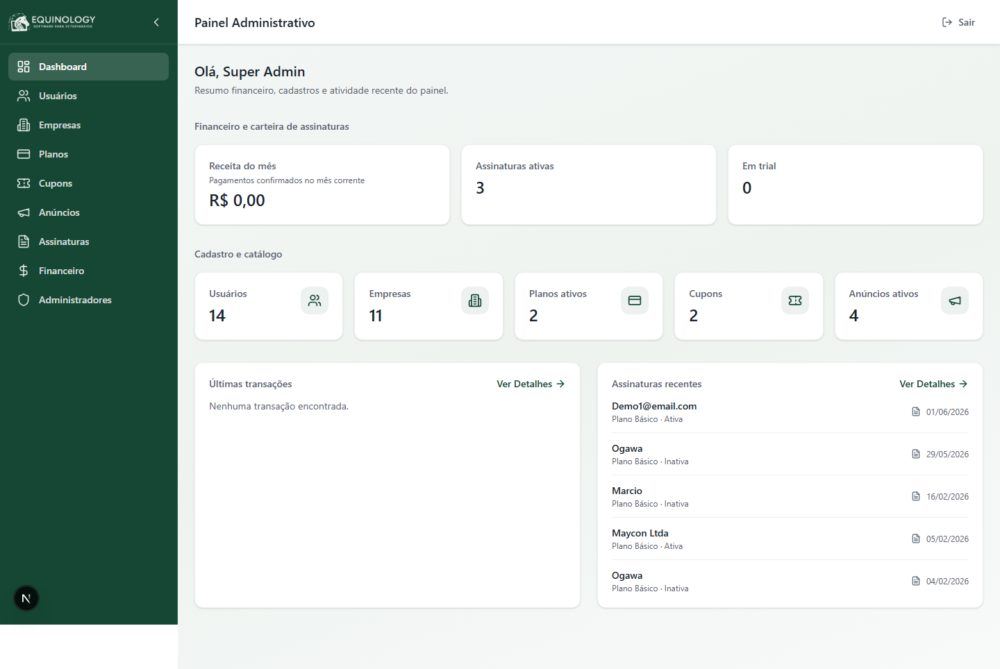

---

### 3.2. Empresas — as clínicas cadastradas

**O que é:** a relação de todas as clínicas (empresas) que usam o sistema, com nome, CNPJ, endereço e data de cadastro.

**Como funciona (fluxo de cadastro de uma nova empresa):**
1. Acessar **Empresas** no menu lateral.
2. Clicar em **"Nova empresa"**.
3. Preencher os dados: nome da empresa, CNPJ, endereço (rua/bairro, número e CEP) e o identificador da carteira de recebimentos.
4. Clicar em **Salvar** — a empresa passa a aparecer na lista.

Para consultar ou alterar uma empresa já existente, basta usar a busca e clicar em **"Detalhes"**.

**Benefício:** controle centralizado de toda a base de clientes da plataforma, com cadastro e consulta simples.

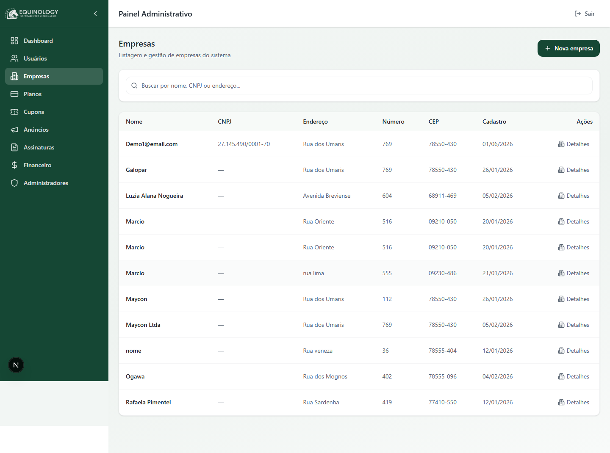

---

### 3.3. Planos — o que é oferecido aos clientes

**O que é:** os planos de assinatura que a Equinology vende. Cada plano mostra o nome, quantos clientes ativos possui, o preço no cartão, o preço no PIX e se está ativo.

**Como funciona (fluxo de criação de um plano):**
1. Acessar **Planos** e clicar em **"Novo plano"**.
2. Definir o **nome** e uma **descrição**.
3. Definir o **limite de usuários** do plano (deixar em branco significa ilimitado).
4. Informar os **preços** no cartão e no PIX.
5. Definir o **desconto para pagamento anual** e o **período de teste gratuito** (em dias).
6. Marcar se o plano fica **ativo** e clicar em **Salvar**.

Planos existentes podem ser editados ou excluídos a qualquer momento.

**Benefício:** flexibilidade total para montar a estratégia comercial — criar planos, ajustar preços, oferecer trial e descontos — sem depender de equipe técnica.

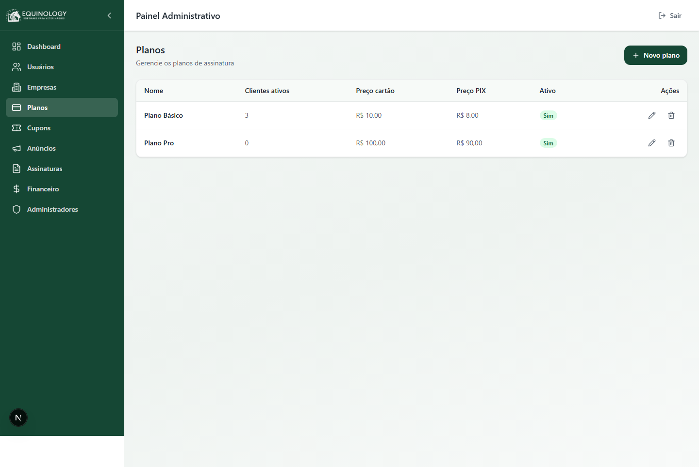

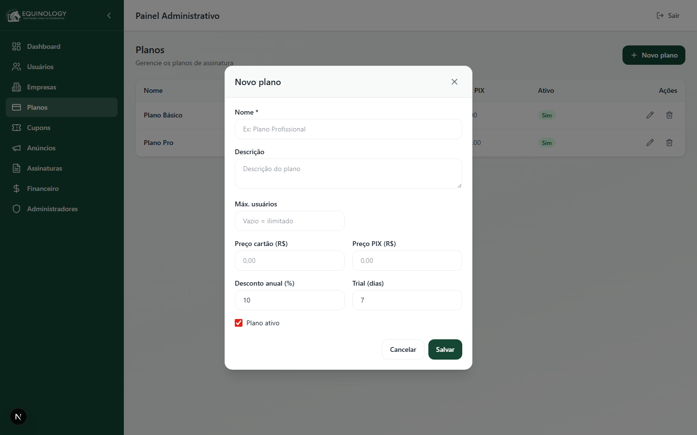

---

### 3.4. Cupons — descontos promocionais

**O que é:** os cupons de desconto que podem ser aplicados nas assinaturas.

**Como funciona (fluxo de criação de um cupom):**
1. Acessar **Cupons** e clicar em **"Novo cupom"**.
2. Definir o **código** do cupom (ex.: PROMO20).
3. Escolher o tipo de desconto: **percentual** (uma porcentagem) ou **valor fixo** (um valor em reais).
4. Definir, se desejado, um **limite de usos** (deixar em branco significa ilimitado).
5. Marcar o cupom como **ativo** e **Salvar**.

**Benefício:** permite criar campanhas e promoções de forma autônoma, estimulando novas assinaturas e a retenção de clientes.

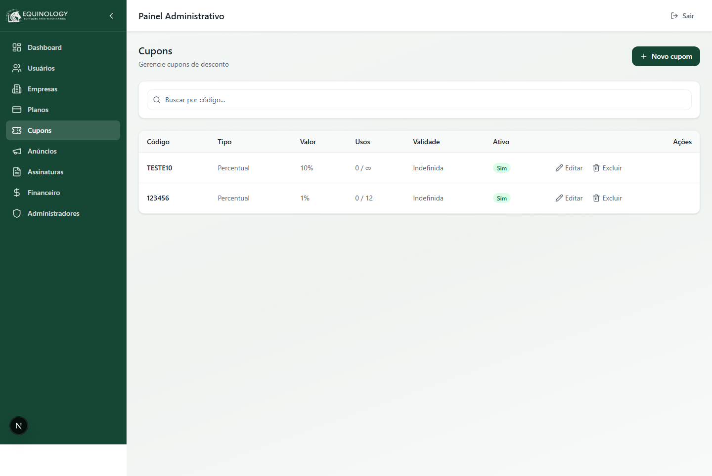

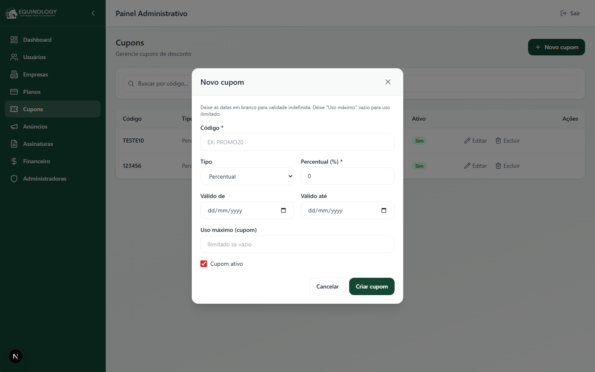

---

### 3.5. Anúncios — campanhas dentro do aplicativo

**O que é:** os anúncios e banners exibidos para os usuários dentro do aplicativo. Cada anúncio tem imagem, nome, link, alcance e status.

**Como funciona (fluxo de criação de um anúncio):**
1. Acessar **Anúncios** e clicar em **"Novo anúncio"**.
2. Informar o **nome** e uma **descrição** (texto do patrocinador).
3. Definir o **link de redirecionamento** (para onde o usuário vai ao tocar no anúncio).
4. Enviar a **imagem** do banner.
5. Definir o **período de exibição** (data de início e fim — em branco significa sem prazo).
6. Escolher o **alcance da exibição**:
   - **Global** — exibido para todos os usuários.
   - **Estadual** — exibido apenas em estados selecionados.
   - **Municipal** — exibido apenas em cidades selecionadas.
7. **Salvar** o anúncio.

**Benefício:** abre uma frente de **monetização por patrocínio** e comunicação direcionada, com controle de onde e quando cada anúncio aparece.

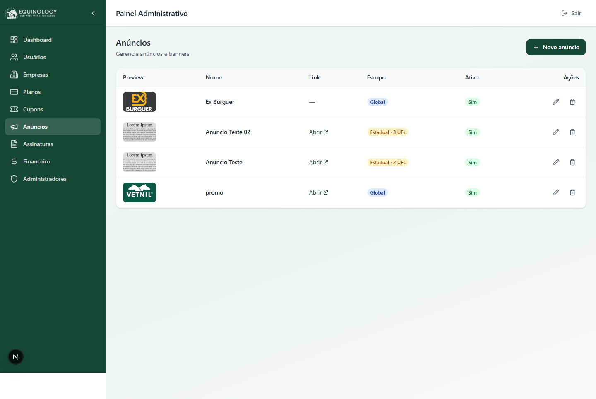

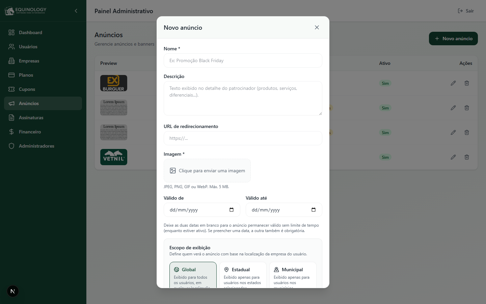

---

### 3.6. Assinaturas — o acompanhamento dos contratos

**O que é:** a relação de todas as assinaturas dos clientes, com o plano contratado, a forma de cobrança e o status (ativa, inativa ou em teste).

**Como funciona:**
- A lista pode ser filtrada por cliente, e-mail, plano ou status.
- Para registrar uma nova assinatura, clicar em **"Nova assinatura"**, escolher o cliente/empresa, o plano, a **periodicidade** (mensal ou anual) e, se aplicável, um **cupom** de desconto.
- Cada assinatura pode ser aberta em **"Detalhes"** para consulta.

**Benefício:** visão clara da base de receita recorrente e da situação de cada cliente, ajudando a identificar oportunidades e evitar perdas.

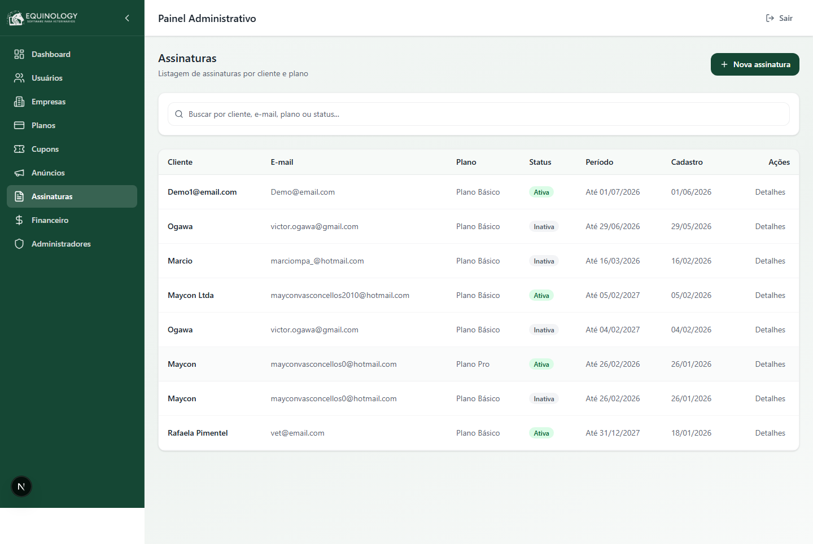

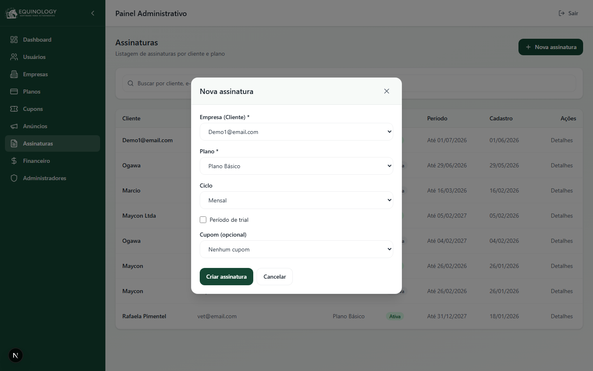

---

### 3.7. Financeiro — transações e receita

**O que é:** o resumo financeiro da plataforma e o histórico de transações.

**O que mostra:**
- Receita do mês, assinaturas ativas e assinaturas em teste.
- Lista de transações, com busca por empresa, plano, status ou forma de pagamento.

**Benefício:** acompanhamento do faturamento de forma transparente e organizada, base para decisões de gestão.

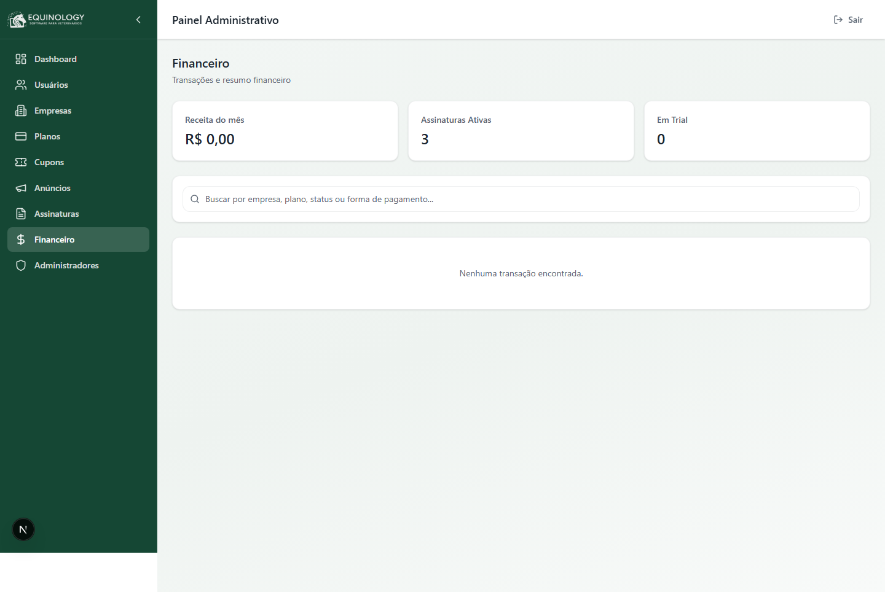

---

### 3.8. Usuários — as pessoas das clínicas

**O que é:** a relação dos usuários do sistema (os veterinários e a equipe das clínicas) cadastrados na plataforma.

**Como funciona:**
- A lista pode ser pesquisada por nome, e-mail ou empresa.
- É possível cadastrar um novo usuário (nome, e-mail, telefone e senha) e consultar os detalhes de cada um.

**Benefício:** visibilidade de quem está utilizando o sistema, apoiando o suporte e o relacionamento com os clientes.

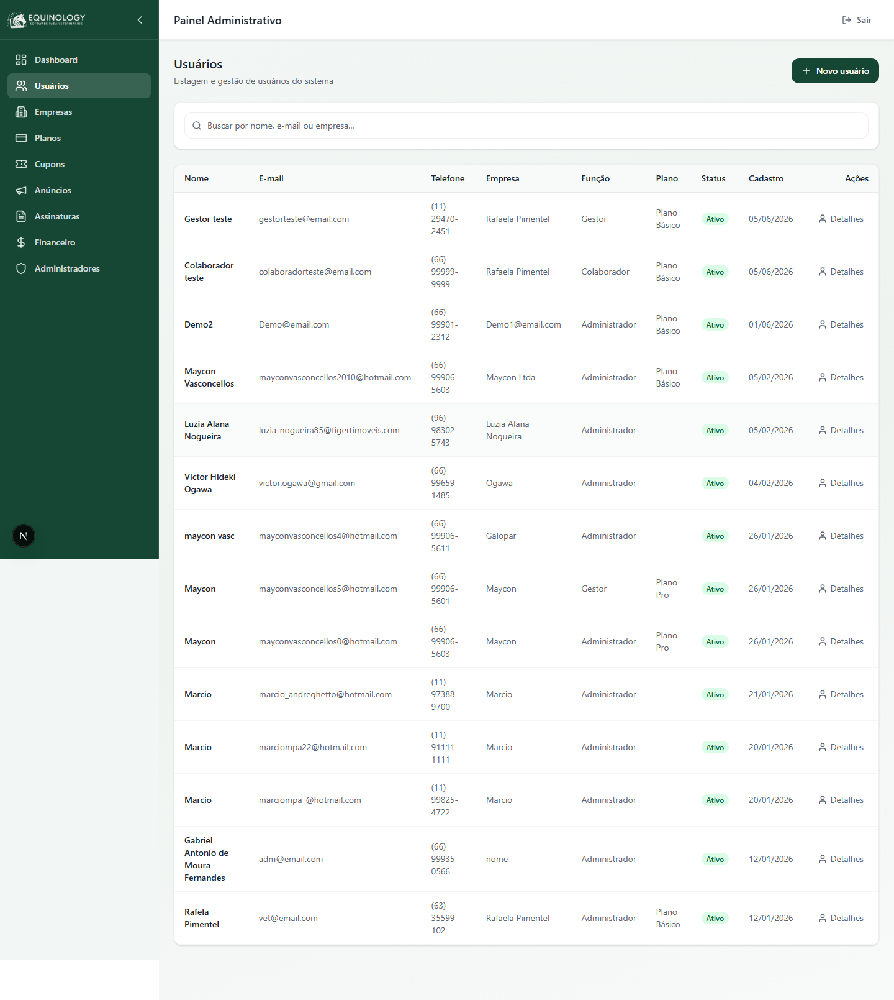

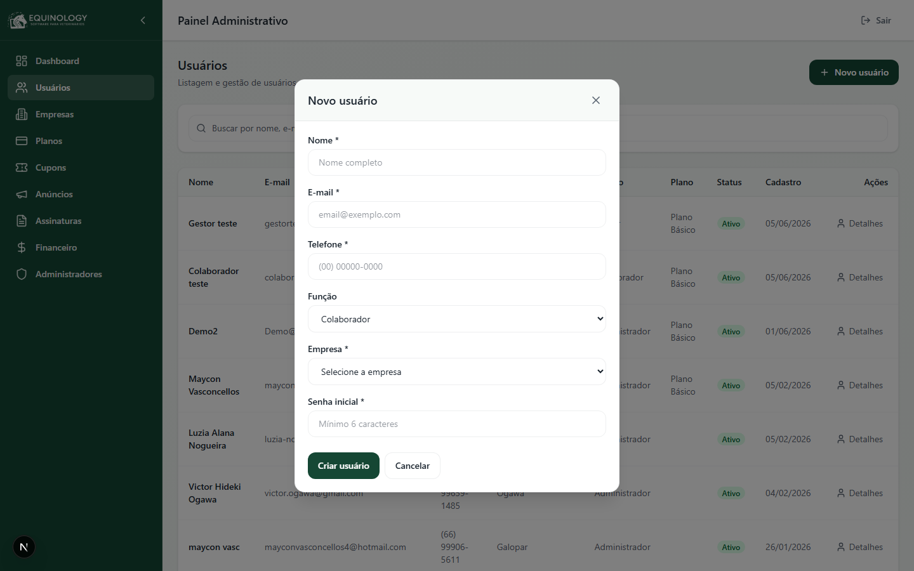

---

### 3.9. Administradores — quem acessa o painel

**O que é:** a área onde se gerencia quem tem acesso ao próprio Painel Administrativo e com qual perfil (Super Admin ou Suporte).

**Como funciona:**
- A lista mostra todos os administradores e seus perfis de acesso.
- Um **Super Admin** pode cadastrar novos administradores (nome, e-mail, senha e perfil) e ajustar permissões.
- Perfis de **Suporte** visualizam as informações, mas não gerenciam acessos.

**Benefício:** segurança e controle — apenas as pessoas certas acessam o painel, cada uma com o nível de permissão adequado.

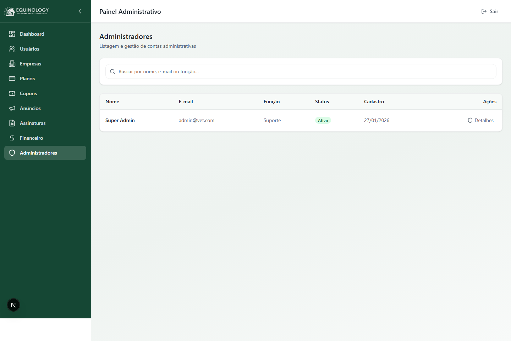

---

## 4. Benefícios para o cliente

- **Tudo em um só lugar:** clínicas, planos, assinaturas, financeiro, anúncios e acessos reunidos em um único painel, com visão sempre atualizada.
- **Autonomia comercial:** criar e ajustar planos, preços, períodos de teste, descontos e cupons sem depender de equipe técnica.
- **Nova fonte de receita:** os anúncios permitem monetizar a base de usuários com patrocínios direcionados por região.
- **Decisões com base em dados:** o Dashboard e o Financeiro mostram receita, assinaturas e atividade recente de forma imediata.
- **Segurança e controle de acesso:** perfis de Super Admin e Suporte garantem que cada pessoa veja e faça apenas o que lhe compete.
- **Facilidade de uso:** todas as áreas seguem o mesmo padrão (lista, busca e ações), tornando o uso intuitivo e o treinamento rápido.

---

*Documento gerado a partir do sistema em funcionamento. As imagens refletem telas reais do Painel Administrativo.*
